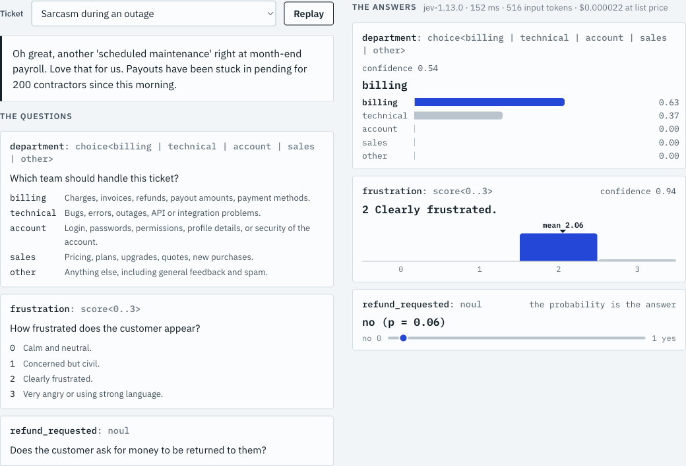
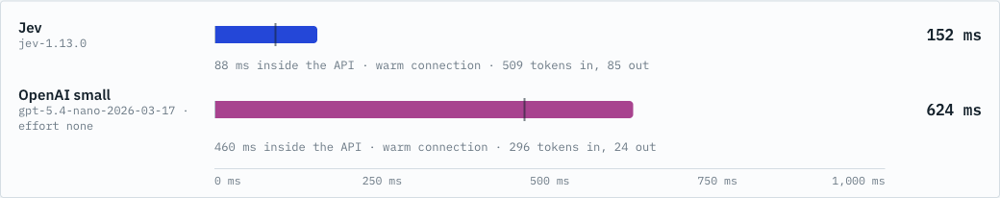
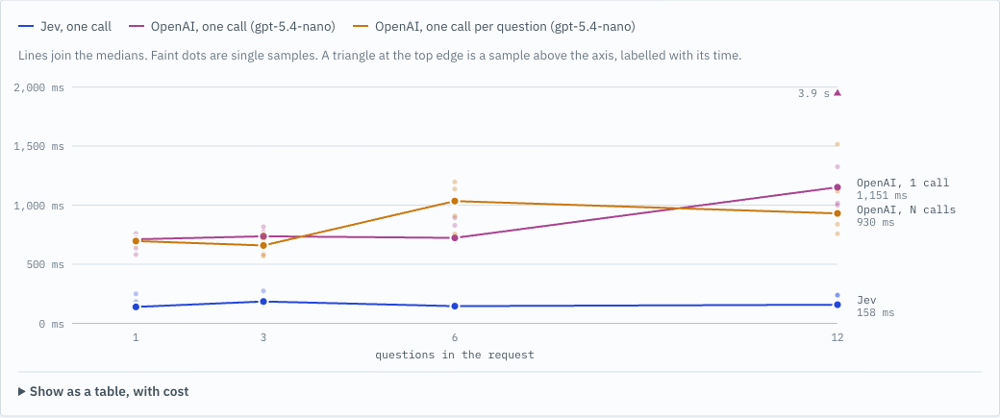
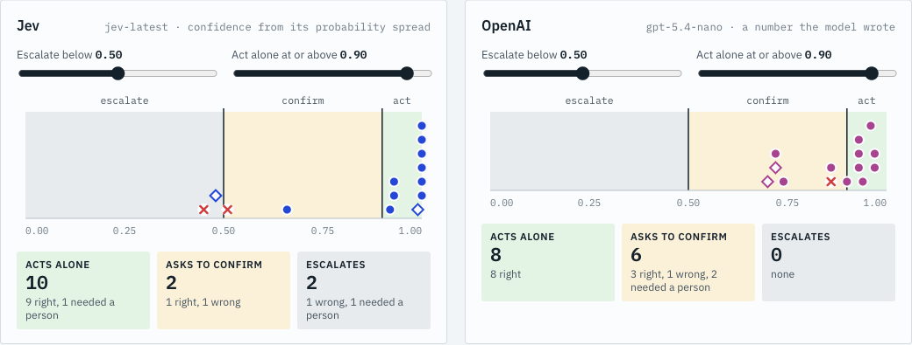

# How Jev Decides

An independent demo of [Jev](https://typesafe.ai/), TypeSafe AI's "System One" model, next to an OpenAI model doing the same job. Not affiliated with TypeSafe AI or OpenAI.

Jev never writes text. You send it some `state` and a set of typed questions (`choice`, `score`, `noul`). It returns typed answers with probabilities and a confidence number. This demo puts that to work on support-ticket triage for a made-up invoicing service.



There are two ways to see it, built from the same code:

| Mode | What it does | How to open |
|---|---|---|
| Live app | Makes real calls to both APIs from a small local server | `node --env-file=.env server.mjs`, then http://127.0.0.1:4173 |
| Replay | Plays back a recording. Makes no API calls | http://127.0.0.1:4173/?replay=1, or the published artifact |

A published replay of the recording lives at https://claude.ai/artifact/SYx39w3KFTTMP5SLR3DcvR. It is private to its owner until shared, so the link only opens for people who have been given access. The same page is in this repo as `artifact/how-jev-decides.html` and opens in any browser.

## Setup

Needs Node 20 or newer. There are no dependencies to install.

```
cp .env.example .env     # then fill in JEV_API_KEY and OPENAI_API_KEY
node --env-file=.env server.mjs
```

Keys stay on the server. The browser never sees them, and neither does any recording.

## What the page shows

1. **What goes in, what comes out.** One ticket, three typed questions, and Jev's answers drawn as probability bars, a level scale and a yes/no track. The raw request and response sit underneath.
2. **Same job, two engines.** A race on a shared time axis, then whether the answers agree, then measured tokens and list-price cost. Every sample is plotted, not just one.
3. **More questions, same wait?** Latency for 1, 3, 6 and 12 questions. OpenAI is tried two ways: one call, and one call per question fired together.
4. **Knowing when it doesn't know.** Fourteen tickets placed by confidence, with sliders that sort them into act alone, confirm and escalate. Wrong answers stay visible.
5. **When not to use Jev.** Three cases from TypeSafe's own list of limits, a diagram of the hybrid pattern, and TypeSafe's claims next to what we measured.

| The race | Latency by number of questions |
|---|---|
|  |  |



## How the comparison is kept fair

- Both engines get the same ticket and the same question and criteria wording.
- OpenAI gets its best setup for this job: one call, strict JSON schema, lowest reasoning effort the model accepts, `store: false`.
- Times are wall-clock for a complete typed answer, measured on the server around each HTTPS request with `node:https` and keep-alive.
- Every timed call runs on a warm connection. Before any burst of concurrent calls, enough connections are opened first, outside the timed window.
- No retries inside a timed call. Failed calls are shown as failed and kept in the recording.
- Samples alternate between engines. The page shows every sample and the median, and no percentiles.
- All 14 tickets, labels and difficulty tiers were written before the first recorded run, and none was removed afterwards. About a third are clear, a third borderline, and a third hard or aimed at Jev's documented weak spots.
- Prices are published list prices with a source and date in `config/pricing.json`. Everything else is measured.
- Results come from one laptop on one network. Yours will differ.

## What we measured on 19 September 2026

Medians over 15 warm samples per engine, three-question call:

| Engine | Median | Cost per call |
|---|---|---|
| Jev (`jev-1.13.0`) | 152 ms | $0.000022 |
| `gpt-5.4-nano`, effort none | 677 ms | $0.000091 |
| `gpt-4.1-nano` | 591 ms | $0.000037 |
| `gpt-5.6-luna`, effort none | 657 ms | $0.000088 |
| `gpt-6-astra`, effort low | 1,912 ms | $0.0042 |

- Jev was about 4 to 5 times faster than the small OpenAI models and about 13 times faster than the frontier model. TypeSafe's site says 193.6 times, measured against frontier LLM workflows.
- Going from 1 to 12 questions, Jev's median stayed between 139 and 185 ms. OpenAI in one call went from 711 to 1,151 ms.
- On 14 tickets Jev got two wrong, both at confidence near 0.5, so a threshold would have caught them. It was also 0.99 confident on "It's not working. Please fix asap.", which needed a person.
- Jev's probabilities come back rounded to two decimals, and it counts more input tokens than OpenAI for the same request.
- OpenAI bills a repeated long prompt at a lower cached rate. 19 of the 180 recorded calls used it, all on the long ticket. The page shows cached tokens and the cost reflects them.
- On three cases from Jev's documented weak spots (counting, date arithmetic, sums) results moved between runs. The date case sat near p = 0.5 and flipped from one run to the next, which is why TypeSafe says to compute these in code.

## Commands

```
node --env-file=.env scripts/probe-models.mjs   # which models can each key reach
node --env-file=.env scripts/probe.mjs          # confirm real API shapes and behaviour
node --test test/                               # unit tests
node --env-file=.env scripts/record.mjs         # about 270 API calls, well under $1
node --env-file=.env scripts/build-artifact.mjs # writes artifact/how-jev-decides.html
```

The builder refuses to write the artifact if it finds a key value, a network API in the bundled JavaScript, an external resource other than Google Fonts, or a file over 1 MB.

## Layout

| Path | Purpose |
|---|---|
| `server.mjs` | Local server. Checks `Host` and `Origin`, requires JSON, sends no CORS headers, rate-limits upstream calls |
| `lib/http.mjs` | Keep-alive HTTPS with a timing breakdown and connection pre-warming |
| `lib/jev.mjs`, `lib/openai.mjs` | One raw call each. No SDKs |
| `lib/schema.mjs` | Turns Jev questions into a strict OpenAI JSON schema and prompt |
| `lib/normalize.mjs` | One answer shape for both engines |
| `lib/sanitize.mjs` | Removes auth material from errors and recordings |
| `scenarios/triage.mjs` | Questions, tickets, author labels, tiers |
| `config/` | OpenAI model preference list, list prices, vendor claims |
| `web/` | The page. `source-live.js` and `source-replay.js` are the two data sources |
| `recordings/latest.json` | The recording that replay mode and the artifact use |
| `artifact/how-jev-decides.html` | The built single-file replay page |
| `docs/DESIGN.md` | The design, the fairness rules, and what changed during the build |

## Notes

- `.env` is ignored by git. Never commit it. Every recording and every built artifact is scanned for the key values before it is written.
- TypeSafe's docs say a `score` question needs at least two levels. The API accepted one level during probing. The client-side check here still enforces the documented limits.
- No license file is included yet, so default copyright applies until one is added.
